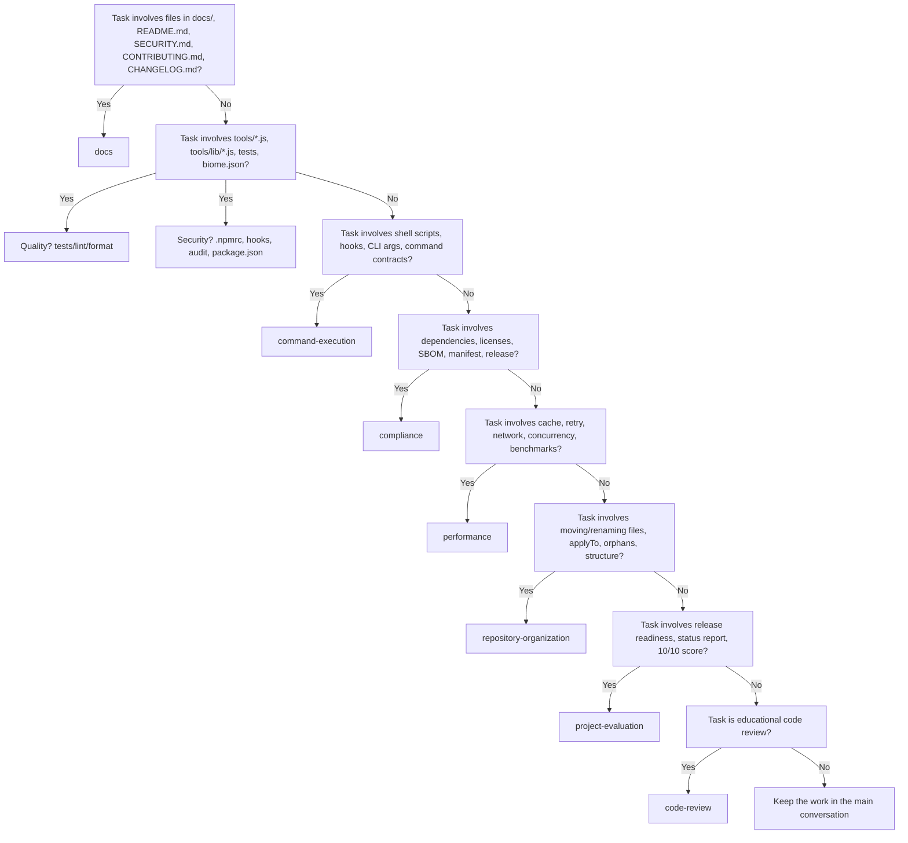

# Subagent Invocation

This skill prevents failed delegations by checking an agent's declared tool set
before asking it to perform work. It also defines how to choose the right agent,
what to do when the agent lacks a tool, and how to verify the result.

## When to invoke a subagent

Use `runSubagent` when the task:
- Requires expertise mapped to a domain agent in `.github/agents/` (docs, security,
  compliance, performance, etc.).
- Touches many files or needs deep exploration, so delegating keeps the main
  conversation focused.
- Can be expressed as a single, self-contained instruction with a clear deliverable.

## Decision tree



### Quick reference

| Task domain | Preferred agent |
| --- | --- |
| Documentation / markdown / bilingual sync | `docs` |
| Defense scripts, tests, lint/format/coverage | `quality` |
| Security gates, `.npmrc`, hooks, audit, signatures | `security` |
| Subprocesses, CLI args, command contracts, shell | `command-execution` |
| Licenses, SBOM, manifest, release readiness | `compliance` |
| Cache, retry, network, benchmarks | `performance` |
| File structure, applyTo, orphans, naming | `repository-organization` |
| Release readiness, status reports, scoring | `project-evaluation` |
| Educational clarity, headers, hardcoded values | `code-review` |

## Pre-delegation checklist

Before calling `runSubagent`, verify every item:

1. **Scope is clear.** The task is self-contained and has a single deliverable.
2. **Agent is correct.** The chosen agent matches the decision tree above.
3. **Tools are present.** The agent's `.agent.md` declares every tool the task
   needs. Use `.github/agents/README.md` for a quick cross-reference.
4. **Repository path is absolute.** The prompt contains the full workspace path.
5. **Mandate is explicit.** State whether the agent may read, write, or run commands.

## Default tool checklist by task type

| Task | Required tools the agent must declare |
| --- | --- |
| Create new files/directories | `create_file`, `create_directory` |
| Edit existing files | `replace_string_in_file` or `multi_replace_string_in_file` |
| Search for files by pattern | `file_search` |
| List directory contents | `list_dir` |
| Read specific files | `read_file` |
| Search file contents | `grep_search` |
| Run validation commands | `run_in_terminal` |
| Fetch external references | `fetch_webpage` |

## Gap-of-tool protocol

If the selected agent does **not** declare a required tool, choose one of:

1. **Handle in main conversation.** Do the work yourself without delegating.
2. **Ask for authorization.** Request user approval to add the missing tool to
   the agent's YAML frontmatter, then update `.github/agents/README.md` via
   `node .github/agents/scripts/generate-capability-matrix.js`.
3. **Partial delegation.** Delegate only the parts the agent can do and complete
   the rest manually.

After any gap is found, record it in `.github/ai-lessons-learned.md`. If the same
agent/task pair fails more than once, open an issue using the
[AI tool gap template](../../ISSUE_TEMPLATE/ai-tool-gap.yml).

## Prompt templates

Use the templates below as starting points. Always replace `{{task}}`, `{{files}}`,
and `{{repoPath}}` with concrete values.

### docs

```text
You are the docs agent for {{repoPath}}.
Task: {{task}}
Files: {{files}}
Rules:
- Keep docs/en/ and docs/pt-BR/ synchronized.
- Validate links with npm run defence:check-md-links.
- Report absolute paths of created/modified files.
Deliverable: {{deliverable}}
```

### security

```text
You are the security agent for {{repoPath}}.
Task: {{task}}
Files: {{files}}
Rules:
- Never weaken age, signature, audit, license, or hook gates.
- Prefer npm ci over npm install.
- Report absolute paths of created/modified files.
Deliverable: {{deliverable}}
```

### quality

```text
You are the quality agent for {{repoPath}}.
Task: {{task}}
Files: {{files}}
Rules:
- Run npm run lint and npm test after changes.
- Justify every hardcoded value with an inline comment.
- Report absolute paths of created/modified files.
Deliverable: {{deliverable}}
```

### command-execution

```text
You are the command-execution agent for {{repoPath}}.
Task: {{task}}
Files: {{files}}
Rules:
- Prefer spawnSync with shell: false.
- Validate CLI args and command contracts explicitly.
- Report absolute paths of created/modified files.
Deliverable: {{deliverable}}
```

### compliance

```text
You are the compliance agent for {{repoPath}}.
Task: {{task}}
Files: {{files}}
Rules:
- Verify SPDX identifiers and allowed licenses.
- Keep adoption manifest and release checklist in sync.
- Report absolute paths of created/modified files.
Deliverable: {{deliverable}}
```

### performance

```text
You are the performance agent for {{repoPath}}.
Task: {{task}}
Files: {{files}}
Rules:
- Use shared registry-cache.js and retry-fetch.js helpers.
- Keep network calls bounded and cacheable.
- Report absolute paths of created/modified files.
Deliverable: {{deliverable}}
```

### repository-organization

```text
You are the repository-organization agent for {{repoPath}}.
Task: {{task}}
Files: {{files}}
Rules:
- Follow file-organization.instructions.md for placement.
- Check applyTo patterns and orphaned files.
- Report absolute paths of created/modified files.
Deliverable: {{deliverable}}
```

### project-evaluation

```text
You are the project-evaluation agent for {{repoPath}}.
Task: {{task}}
Files: {{files}}
Rules:
- Assess release readiness against the 10/10 quality score criteria.
- Update PROJECT_STATUS_REPORT.md and TODO.md when needed.
- Report absolute paths of created/modified files.
Deliverable: {{deliverable}}
```

### code-review

```text
You are the code-review agent for {{repoPath}}.
Task: {{task}}
Files: {{files}}
Rules:
- Focus on educational clarity: headers, error messages, hardcoded values.
- Suggest concrete improvements; do not apply changes unless asked.
- Report absolute paths of reviewed files.
Deliverable: {{deliverable}}
```

## Post-delegation checklist

After the subagent returns:

1. **Files reported.** The response lists absolute paths of created/modified files.
2. **Validations ran.** The agent executed `npm run lint`, `npm test`, and link
   checks when applicable.
3. **Security preserved.** No gates were weakened.
4. **Bilingual docs kept.** If user-facing behavior changed, both `docs/en/` and
   `docs/pt-BR/` were updated.

## Anti-patterns

- **"Create files with a read-only agent."** If an agent lacks `create_file`
  and `create_directory`, do not ask it to create documentation. This happened
  on 2026-09-08 with the `docs` agent and is recorded in
  `.github/ai-lessons-learned.md`.
- **"Run commands with a code-only agent."** If an agent lacks `run_in_terminal`,
  do not ask it to execute validation scripts or subprocess calls.
- **"Fetch URLs with an offline agent."** If an agent lacks `fetch_webpage`,
  do not ask it to verify external references.
- **"Skip post-delegation validation."** Always verify the subagent's output
  before declaring the task complete.

## Recovery

If a subagent reports missing tools:
1. Note the task and the agent that failed.
2. Update the agent's `tools:` list in `.github/agents/<domain>.agent.md`.
3. Re-run `.github/agents/scripts/generate-capability-matrix.js` to update
   `.github/agents/README.md`.
4. Record the incident in `.github/ai-lessons-learned.md`.
5. Re-run the delegation or complete the task in the main conversation.
