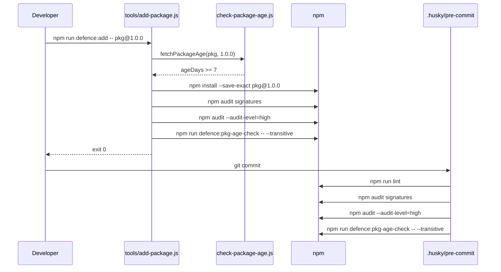

# Architecture

This document describes the high-level architecture of the project: how the files, scripts, and security layers fit together.

## Repository Layout

```
.
├── .husky/pre-commit        # Git hook executed on every commit
├── .npmrc                   # Hardened npm defaults
├── biome.json               # Biome lint and format configuration
├── package.json             # Project manifest and npm scripts
├── package-lock.json        # Deterministic dependency tree
├── README.md                # Entry point documentation
├── docs/                    # Multilingual documentation (en, pt-BR)
└── tools/                   # Defence scripts and tests
    ├── add-package.js
    ├── check-package-age.js
    ├── install-defences.js
    ├── setup-bootstrap.js
    ├── update-packages.js
    └── lib/package-utils.js
```

## Components

| Component | Responsibility |
| --- | --- |
| `package.json` | Declares dependencies, scripts, engines, and `pkgAgeCheck` settings. |
| `.npmrc` | Enforces `save-exact`, `ignore-scripts`, `min-release-age=7`, `audit-level=high`, etc. |
| `.husky/pre-commit` | Triggers `npm run lint`, signature audit, and transitive age check before each commit. |
| `tools/check-package-age.js` | Queries the npm registry to enforce the minimum package age. |
| `tools/add-package.js` | Controlled wrapper for `npm install` that runs age, signature, audit, and transitive checks. |
| `tools/setup-bootstrap.js` | Performs the first install when `package-lock.json` is missing. |
| `tools/update-packages.js` | Controlled wrapper for `npm update`. |
| `tools/install-defences.js` | Copies defences into another Node.js project. |
| `tools/lib/package-utils.js` | Shared helpers for parsing package specifiers. |
| `biome.json` | Configures Biome as linter and formatter. |

## Dependency-Add Flow



## Design Decisions

- **Native Node.js modules only** in the tooling scripts, so they can run before any dependency is installed.
- **Injection pattern** (`setSpawnSyncImpl` / `resetSpawnSyncImpl`) makes the scripts testable without running real `npm` commands.
- ** defence:* prefix** groups all security-related scripts and reduces friction when adopting the defences in other projects.

_Last sync: 2026-08-18_.
