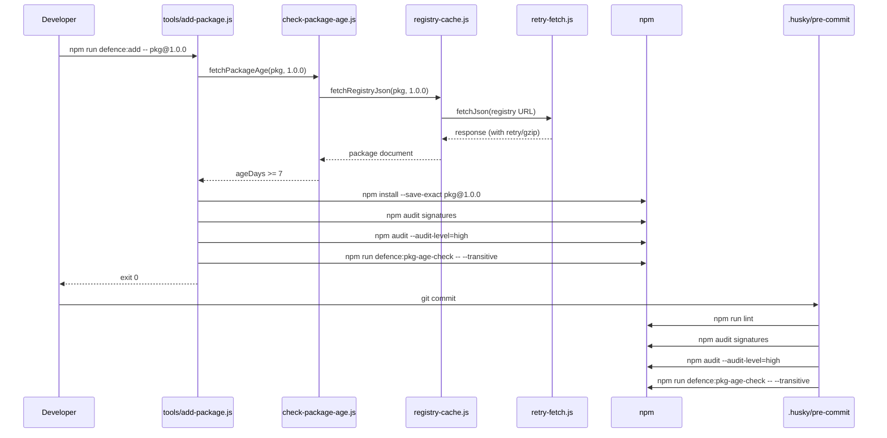

# Architecture

This document describes the high-level architecture of the project: how the files, scripts, and security layers fit together.

## Repository Layout

```bash
.
├── .github/
│   ├── copilot-instructions.md       # Always-on AI instructions
│   ├── instructions/                 # Task-specific AI instructions
│   │   ├── security.instructions.md
│   │   ├── testing.instructions.md
│   │   └── docs.instructions.md
│   └── workflows/ci.yml              # GitHub Actions CI pipeline
├── .husky/
│   ├── pre-commit                    # Git hook executed on every commit
│   └── post-merge                    # Hook that warns when node_modules is stale
├── .npmrc                              # Hardened npm defaults
├── biome.json                          # Biome lint and format configuration
├── package.json                        # Project manifest and npm scripts
├── package-lock.json                   # Deterministic dependency tree
├── README.md                           # Entry point documentation
├── docs/                               # Multilingual documentation (en, pt-BR)
└── tools/                              # Defence scripts and tests
    ├── add-package.js
    ├── check-engines.js
    ├── check-hooks.js
    ├── check-licenses.js
    ├── check-lockfile-integrity.js
    ├── check-md-links.js
    ├── check-package-age.js
    ├── check-secrets.js
    ├── check-sync.js
    ├── check-updates.js
    ├── generate-sbom.js
    ├── install-defences.js
    ├── integration.test.js
    ├── setup-bootstrap.js
    ├── update-badge.js
    ├── update-packages.js
    ├── verify-defences.js
    └── lib/
        ├── config.js
        ├── package-utils.js
        ├── provenance.js
        ├── registry-cache.js
        ├── retry-fetch.js
        ├── sync-check.js
        └── config.test.js
```

## Components

| Component | Responsibility |
| --- | --- |
| `package.json` | Declares dependencies, scripts, engines, and configuration blocks (`pkgAgeCheck`, `updateCheck`, `licensesCheck`, `typosquattingCheck`, `defences`). |
| `.npmrc` | Enforces `save-exact`, `ignore-scripts`, `min-release-age=7`, `audit-level=high`, etc. |
| `.husky/pre-commit` | Triggers lint, signature audit, vulnerability audit, transitive age check, update check, and license check before each commit. |
| `.husky/post-merge` | Warns when `node_modules` is out of sync after `git pull` or `git merge`. |
| `.github/workflows/ci.yml` | Runs tests, lint, link checks, license scan, lockfile integrity, secret scan, and defence gates on every PR and push. |
| `.github/copilot-instructions.md` | Always-on instructions for GitHub Copilot / Kimi 2.7 Code. |
| `tools/check-engines.js` | Validates active Node.js and npm versions against `engines`. |
| `tools/check-package-age.js` | Queries the npm registry to enforce the minimum package age. |
| `tools/check-updates.js` | Warns about available updates and classifies them as eligible or quarantined. |
| `tools/add-package.js` | Controlled wrapper for `npm install` that runs age, signature, audit, license, and transitive checks. |
| `tools/setup-bootstrap.js` | Performs the first install when `package-lock.json` is missing. |
| `tools/update-packages.js` | Controlled wrapper for `npm update` with optional interactive approval. |
| `tools/update-badge.js` | Refreshes the test-count badge in `README.md`. |
| `tools/check-licenses.js` | Scans dependency licenses against allow/deny lists. |
| `tools/check-sync.js` | Standalone command that verifies `node_modules` matches `package-lock.json`. |
| `tools/check-lockfile-integrity.js` | Verifies that every lockfile entry has a strong integrity hash. |
| `tools/check-hooks.js` | Verifies `.husky/pre-commit` against the known hash in `package.json`. |
| `tools/check-secrets.js` | Scans files for likely secrets before commit. |
| `tools/check-md-links.js` | Validates internal and external markdown links. |
| `tools/generate-sbom.js` | Generates a CycloneDX 1.4 JSON SBOM from `package-lock.json`. |
| `tools/install-defences.js` | Copies defences into another Node.js project and writes `.defence-manifest.json`. |
| `tools/verify-defences.js` | Verifies copied files against `.defence-manifest.json`. |
| `tools/lib/package-utils.js` | Shared helpers for parsing package specifiers. |
| `tools/lib/registry-cache.js` | Disk-backed registry response cache shared by tools that query npm. |
| `tools/lib/retry-fetch.js` | Shared fetch layer with gzip support, response-size limits, and retry/backoff. |
| `tools/lib/sync-check.js` | Verifies that `node_modules` matches `package-lock.json`. |
| `tools/lib/config.js` | Centralized configuration loader. |
| `tools/lib/provenance.js` | Helpers for npm provenance and SLSA attestation verification. |
| `tools/integration.test.js` | Cross-tool integration tests with mocked registry and in-memory fixtures. |
| `biome.json` | Configures Biome as linter and formatter. |

## Dependency-Add Flow



## Shared Registry Layer

Tools that query the npm registry (`check-package-age.js`, `check-updates.js`) do not call `https.get` directly. They go through two shared modules:

- **`tools/lib/retry-fetch.js`** — handles HTTPS, gzip decompression, response-size limits, and transient-failure retry with exponential backoff. It retries only on network errors and on HTTP `429`, `502`, `503`, `504`; other failures (e.g., `404`, invalid JSON) fail fast to avoid infinite loops.
- **`tools/lib/registry-cache.js`** — stores successful registry responses on disk under `.cache/registry/` keyed by `name@version`. Cache entries respect a configurable TTL, can be bypassed with `force: true`, and are skipped entirely when the environment variable `DEFENCE_NO_CACHE=1` is set.

This design keeps network behaviour consistent, reduces repeated registry calls, and makes every consumer automatically benefit from performance and resilience improvements.

## Design Decisions

- **Native Node.js modules only** in the tooling scripts, so they can run before any dependency is installed.
- **Injection pattern** (`setSpawnSyncImpl` / `resetSpawnSyncImpl`, `setImpls` / `resetImpls`) makes the scripts testable without running real `npm` commands.
- **Shared fetch/cache layer** centralises retry, gzip, and caching so no tool reimplements them.
- **defence:* prefix** groups all security-related scripts and reduces friction when adopting the defences in other projects.
