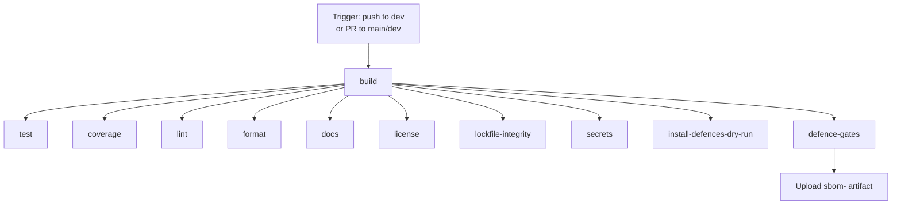

# CI/CD Overview

The repository’s continuous integration workflow is defined in [`.github/workflows/ci.yml`](../../.github/workflows/ci.yml). It is designed to catch supply-chain issues early, enforce least-privilege GitHub tokens, and guarantee that every job runs against the exact same installed dependencies.

## Workflow triggers

- `push` to `dev`
- `pull_request` to `main` and `dev`

This limits automatic runs on the protected `main` branch to pull requests only.

## Workflow diagram



## Jobs

| Job | Purpose | Key step |
|---|---|---|
| `build` | Prepare a reproducible environment | `npm ci` + upload `node_modules` artifact |
| `test` | Run the test suite | Download artifact, `npm test` |
| `coverage` | Measure test coverage | Download artifact, coverage command |
| `lint` | Check code quality | `npm run lint` |
| `format` | Check formatting | `npm run format:check` |
| `docs` | Validate documentation | Docs checks |
| `license` | Validate dependency licenses | License audit |
| `lockfile-integrity` | Verify lockfile consistency | Lockfile checks |
| `secrets` | Scan for leaked secrets | Secret scan |
| `install-defences-dry-run` | Verify the local manifest and dry-run installer | `npm run defence:verify-defences` + `node ./tools/install-defences.js /tmp/target-project --dry-run` |
| `defence-gates` | Run defence gates and produce an SBOM | Upload `/tmp/sbom.json` as `sbom-${{ github.run_id }}` |

Every job has `timeout-minutes: 15` to prevent runaway workers.

## Pinned actions

All GitHub Actions are pinned by commit SHA with a semantic-version comment, for example:

```yaml
- uses: actions/checkout@3d3c42e5aac5ba805825da76410c181273ba90b1 # v7
```

SHA pinning ensures that the exact, audited code runs even if a tag is moved or compromised. Dependabot is configured in [`.github/dependabot.yml`](../../.github/dependabot.yml) to propose weekly updates with the prefix `chore(deps)`.

## `node_modules` artifact caching

The `build` job installs dependencies once with `npm ci` and creates a tarball named `node_modules.tar.gz`. The tarball is then uploaded as an artifact named:

```text
node_modules-${{ github.run_id }}
```

Downstream jobs download this artifact and extract the tarball instead of running `npm ci` again. We use an artifact rather than `actions/cache` because:

- **Determinism:** every job in the run receives the exact same `node_modules` tree.
- **No cross-run poisoning:** an artifact is scoped to the current workflow run and expires after `retention-days: 1`.
- **Auditability:** the artifact can be downloaded and inspected later.

The tree is archived as a `tar.gz` because GitHub Actions artifacts are stored as ZIP files, which do not preserve Unix symlinks or executable permissions. A tarball preserves `node_modules/.bin` entries exactly as `npm ci` produced them, preventing failures such as `sh: 1: biome: not found`.

## Minimal `GITHUB_TOKEN` permissions

The workflow uses workflow-level minimal permissions:

```yaml
permissions:
  contents: read
  actions: write
```

- `contents: read` is enough to check out code.
- `actions: write` is required to upload and download workflow artifacts.
- No other scopes are granted, limiting the blast radius of a compromised action.

## Downloading and inspecting the SBOM

The `defence-gates` job uploads `/tmp/sbom.json` as:

```text
sbom-${{ github.run_id }}
```

with `retention-days: 30` and `archive: false`, so the JSON file is downloadable directly from the workflow run summary.

From the command line:

```bash
gh run download <run-id> -n sbom-<run-id>
```

For more details, see [sbom-and-compliance.md](sbom-and-compliance.md).

## actionlint

The `build` job runs `actionlint` using a pinned binary:

```text
actionlint v1.7.4
SHA256: fc0a6886bbb9a23a39eeec4b176193cadb54ddbe77cdbb19b637933919545395
```

The local [`.husky/pre-commit`](../../.husky/pre-commit) hook also runs `actionlint` when it is installed; a missing local binary emits a warning, but CI enforces it.

## Troubleshooting

### Artifact download failure

- Verify the `build` job completed successfully.
- Check that the artifact has not expired (`retention-days: 1` for `node_modules`).
- Confirm the download job depends on `build`.

### `node_modules is out of sync` or `biome: not found` in CI

These errors usually mean the `node_modules` artifact lost Unix metadata during the upload/download cycle:

- **Cause:** `actions/upload-artifact` stores artifacts as ZIP archives, which drop symlinks and executable bits inside `node_modules/.bin`.
- **Fix in this workflow:** the `build` job creates `node_modules.tar.gz` with `tar`, and downstream jobs extract it with `tar --extract --gzip --file node_modules.tar.gz`.
- **Local check:** run `npm run defence:sync-check` and confirm `./node_modules/.bin/biome --help` works after a fresh `npm ci`.
- **Force refresh:** push a new commit or re-run the workflow; the artifact is regenerated on every run.

### Job timeout

- All jobs are capped at 15 minutes. If a job times out, check for hanging tests or network retries.

### actionlint failure

- Make sure the workflow YAML is valid.
- Run `actionlint` locally if it is installed.
- On CI, only the pinned binary is used.

### Manifest divergence

- Run `npm run defence:verify-defences` locally.
- Ensure the manifest matches the committed state.
