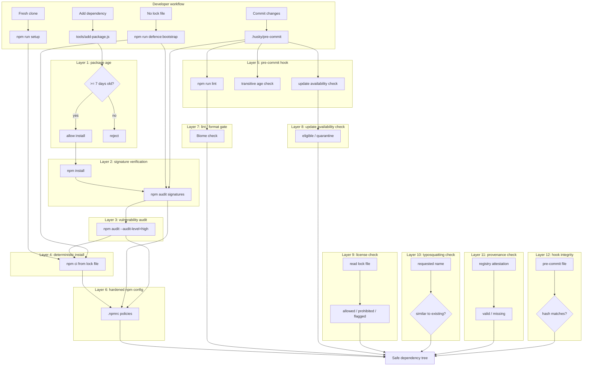

# Security Overview

This project protects the dependency tree using twelve complementary layers. Each layer addresses a different attack vector, and together they make it much harder for a malicious or compromised package to enter the project.

## Defense Groups

The twelve defenses are organized into three adoption groups. Start with the **Core** group and add the others as your project matures.

### Core — Minimum Necessary

These defenses are essential for any Node.js/npm project adopting this toolkit.

| Layer | Defense | Trigger |
| --- | --- | --- |
| 1 | [Package age check](defense-layer-1-package-age.md) | `npm run setup`, `npm run defence:add`, `npm run defence:update`, `npm run defence:reinstall`, `npm run defence:bootstrap` |
| 2 | [Signature verification](defense-layer-2-signatures.md) | `npm run setup`, `npm run defence:add`, `npm run defence:update`, `npm run defence:bootstrap`, pre-commit hook |
| 3 | [Vulnerability audit](defense-layer-3-vulnerabilities.md) | `npm run setup`, `npm run defence:add`, `npm run defence:update`, `npm run defence:bootstrap`, pre-commit hook |
| 4 | [Deterministic install](defense-layer-4-deterministic-install.md) | `npm ci` in `setup` / `defence:reinstall` |
| 5 | [Pre-commit hook](defense-layer-5-precommit-hook.md) | Every `git commit` |
| 6 | [Hardened `.npmrc`](defense-layer-6-npmrc-config.md) | Every npm command |

### Recommended — Production & Team Use

Add these when the project is in production or has multiple contributors.

| Layer | Defense | Trigger |
| --- | --- | --- |
| 7 | [Lint / format gate](defense-layer-7-lint-format.md) | `npm run lint`, pre-commit hook |
| 8 | [Update availability check](defense-layer-8-update-check.md) | `npm run defence:update-check`, pre-commit hook |
| 9 | [License check](defense-layer-9-license-check.md) | `npm run defence:license-check`, `npm run defence:add`, pre-commit hook |
| 12 | [Pre-commit hook integrity](defense-layer-12-hook-integrity.md) | `npm run setup`, `npm run defence:check-hooks` |

### Advanced / Desirable — Compliance & Mature Security

These provide extra assurance for teams with strong security requirements.

| Layer | Defense | Trigger |
| --- | --- | --- |
| 10 | [Typosquatting & dependency confusion](defense-layer-10-typosquatting.md) | `npm run defence:add` |
| 11 | [Provenance & SLSA attestation](defense-layer-11-provenance.md) | `npm run defence:add` |

In addition, the toolkit provides supporting capabilities that do not fit a single layer:

| Capability | Tool | Purpose |
| --- | --- | --- |
| Lifecycle script analysis | `defence:analyze-lifecycle-scripts` | Static, read-only scan of package lifecycle scripts before install |
| Trust score dashboard | `defence:trust-report` | Aggregate supply-chain signals into a per-package 0–100 score |
| SBOM generation | `defence:generate-sbom` | CycloneDX 1.4 JSON for compliance and incident response |
| Adoption integrity | `defence:verify-defences` | Verify files copied by `install-defences.js` |

## Support Guides

Some defensive choices require documented exception paths:

- [Troubleshooting](../troubleshooting.md) — common failures and how to run each defense manually.
- [Rebuilding lifecycle-script packages](rebuilding-lifecycle-packages.md) — safely rebuild native packages after `ignore-scripts`.

## Defense Layers Diagram

## Complete Layer Reference

1. [Package age check](defense-layer-1-package-age.md)
2. [Signature verification](defense-layer-2-signatures.md)
3. [Vulnerability audit](defense-layer-3-vulnerabilities.md)
4. [Deterministic install](defense-layer-4-deterministic-install.md)
5. [Pre-commit hook](defense-layer-5-precommit-hook.md)
6. [Hardened `.npmrc`](defense-layer-6-npmrc-config.md)
7. [Lint / format gate](defense-layer-7-lint-format.md)
8. [Update availability check](defense-layer-8-update-check.md)
9. [License check](defense-layer-9-license-check.md)
10. [Typosquatting & dependency confusion](defense-layer-10-typosquatting.md)
11. [Provenance & SLSA attestation](defense-layer-11-provenance.md)
12. [Pre-commit hook integrity](defense-layer-12-hook-integrity.md)

## Threat Model in a Nutshell

- **Newly published malicious package** → blocked by package-age check.
- **Compromised package without valid registry signature** → blocked by signature verification.
- **Known vulnerable package** → blocked by `npm audit`.
- **Unexpected lock-file drift** → blocked by `npm ci` and pre-commit checks.
- **Accidental insecure npm behavior** → blocked by hardened `.npmrc`.
- **Low-quality or inconsistent code reaching the repository** → blocked by the Biome lint / format gate in the pre-commit hook.
- **Dependencies drifting out of date unnoticed** → surfaced by the update availability check in the pre-commit hook.
- **Legal incompatibility from dependency licenses** → surfaced by the license check.
- **Typosquatting and dependency confusion** → blocked by the typosquatting check in `add-package.js`.
- **Packages built from untrusted sources** → surfaced by the provenance check.
- **Tampered pre-commit hook** → blocked by the hook integrity check.
