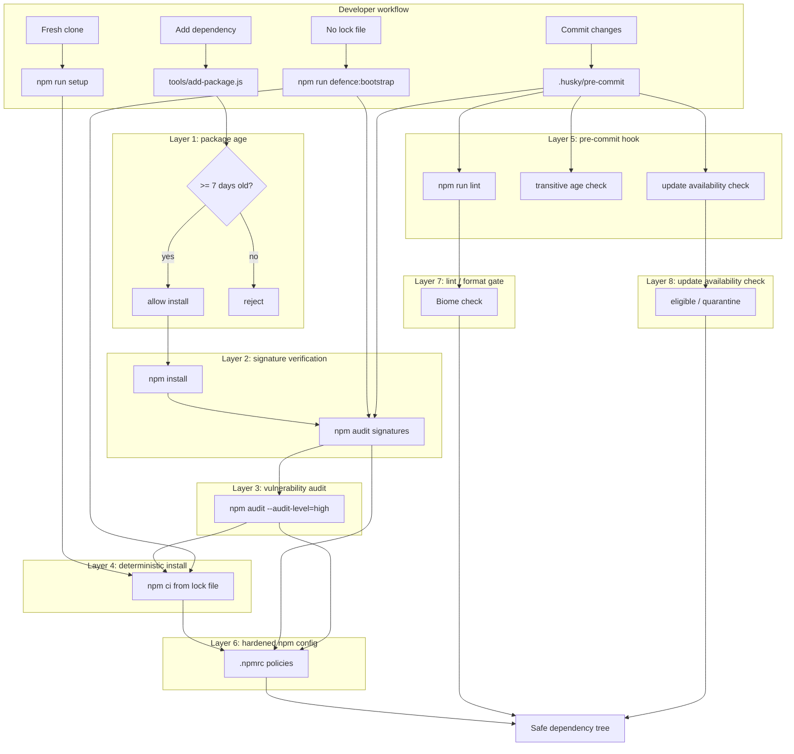

# Security Overview

This project protects the dependency tree using seven complementary layers. Each layer addresses a different attack vector, and together they make it much harder for a malicious or compromised package to enter the project.

## Defense Layers Diagram

## Layer Reference

1. [Package age check](defense-layer-1-package-age.md)
2. [Signature verification](defense-layer-2-signatures.md)
3. [Vulnerability audit](defense-layer-3-vulnerabilities.md)
4. [Deterministic install](defense-layer-4-deterministic-install.md)
5. [Pre-commit hook](defense-layer-5-precommit-hook.md)
6. [Hardened `.npmrc`](defense-layer-6-npmrc-config.md)
7. [Lint / format gate](defense-layer-7-lint-format.md)
8. [Update availability check](defense-layer-8-update-check.md)

## Threat Model in a Nutshell

- **Newly published malicious package** → blocked by package-age check.
- **Compromised package without valid registry signature** → blocked by signature verification.
- **Known vulnerable package** → blocked by `npm audit`.
- **Unexpected lock-file drift** → blocked by `npm ci` and pre-commit checks.
- **Accidental insecure npm behavior** → blocked by hardened `.npmrc`.
- **Low-quality or inconsistent code reaching the repository** → blocked by the Biome lint / format gate in the pre-commit hook.
- **Dependencies drifting out of date unnoticed** → surfaced by the update availability check in the pre-commit hook.
