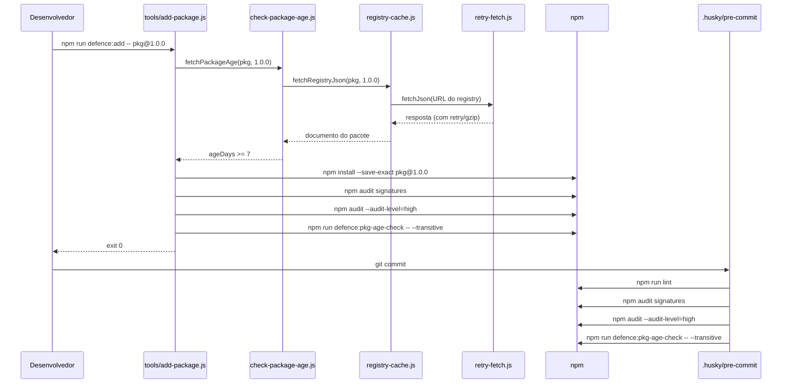

# Arquitetura

Este documento descreve a arquitetura de alto nível do projeto: como os arquivos, scripts e camadas de segurança se encaixam.

## Estrutura do Repositório

```bash
.
├── .github/
│   ├── copilot-instructions.md       # Instruções de AI sempre ativas
│   ├── instructions/                 # Instruções de AI específicas por tarefa
│   │   ├── security.instructions.md
│   │   ├── testing.instructions.md
│   │   └── docs.instructions.md
│   └── workflows/ci.yml              # Pipeline CI do GitHub Actions
├── .husky/
│   ├── pre-commit                    # Hook do Git executado a cada commit
│   └── post-merge                    # Hook que avisa quando node_modules está desatualizado
├── .npmrc                              # Defaults endurecidos do npm
├── biome.json                          # Configuração de lint e format do Biome
├── package.json                        # Manifesto do projeto e scripts npm
├── package-lock.json                   # Árvore de dependências determinística
├── README.md                           # Documentação de entrada
├── docs/                               # Documentação multilíngue (en, pt-BR)
└── tools/                              # Scripts de defesa e testes
    ├── add-package.js
    ├── check-engines.js
    ├── check-hooks.js
    ├── check-licenses.js
    ├── check-lockfile-integrity.js
    ├── check-md-links.js
    ├── check-package-age.js
    ├── check-secrets.js
    ├── check-sync.js
    ├── check-updates.js
    ├── generate-sbom.js
    ├── install-defences.js
    ├── integration.test.js
    ├── setup-bootstrap.js
    ├── update-badge.js
    ├── update-packages.js
    ├── verify-defences.js
    └── lib/
        ├── config.js
        ├── package-utils.js
        ├── provenance.js
        ├── registry-cache.js
        ├── retry-fetch.js
        ├── sync-check.js
        └── config.test.js
```

## Componentes

| Componente | Responsabilidade |
| --- | --- |
| `package.json` | Declara dependências, scripts, engines e blocos de configuração (`pkgAgeCheck`, `updateCheck`, `licensesCheck`, `typosquattingCheck`, `defences`). |
| `.npmrc` | Impõe `save-exact`, `ignore-scripts`, `min-release-age=7`, `audit-level=high`, etc. |
| `.husky/pre-commit` | Dispara lint, audit de assinaturas, audit de vulnerabilidades, verificação transitiva de idade, verificação de atualizações e verificação de licenças antes de cada commit. |
| `.husky/post-merge` | Avisa quando `node_modules` está desatualizado após `git pull` ou `git merge`. |
| `.github/workflows/ci.yml` | Executa testes, lint, verificação de links, scan de licenças, integridade do lockfile, scan de secrets e gates de defesa em cada PR e push. |
| `.github/copilot-instructions.md` | Instruções sempre ativas para GitHub Copilot / Kimi 2.7 Code. |
| `tools/check-engines.js` | Valida as versões ativas do Node.js e npm contra `engines`. |
| `tools/check-package-age.js` | Consulta o registry do npm para aplicar a idade mínima dos pacotes. |
| `tools/check-updates.js` | Alerta sobre atualizações disponíveis e as classifica como elegíveis ou em quarentena. |
| `tools/add-package.js` | Wrapper controlado para `npm install` que executa verificações de idade, assinatura, audit, licença e idade transitiva. |
| `tools/setup-bootstrap.js` | Realiza a primeira instalação quando `package-lock.json` está ausente. |
| `tools/update-packages.js` | Wrapper controlado para `npm update` com aprovação interativa opcional. |
| `tools/update-badge.js` | Atualiza o badge de contagem de testes no `README.md`. |
| `tools/check-licenses.js` | Escaneia licenças de dependências contra listas de permissão e proibição. |
| `tools/check-sync.js` | Comando standalone que verifica se `node_modules` corresponde ao `package-lock.json`. |
| `tools/check-lockfile-integrity.js` | Verifica se cada entrada do lockfile possui um hash de integridade forte. |
| `tools/check-hooks.js` | Verifica se `.husky/pre-commit` corresponde ao hash conhecido em `package.json`. |
| `tools/check-secrets.js` | Verifica arquivos em busca de possíveis secrets antes do commit. |
| `tools/check-md-links.js` | Valida links internos e externos em markdown. |
| `tools/generate-sbom.js` | Gera um SBOM CycloneDX 1.4 JSON a partir do `package-lock.json`. |
| `tools/install-defences.js` | Copia as defesas para outro projeto Node.js e escreve `.defence-manifest.json`. |
| `tools/verify-defences.js` | Verifica arquivos copiados contra `.defence-manifest.json`. |
| `tools/lib/package-utils.js` | Helpers compartilhados para parse de especificadores de pacotes. |
| `tools/lib/registry-cache.js` | Cache em disco de respostas do registry compartilhado entre as ferramentas. |
| `tools/lib/retry-fetch.js` | Camada compartilhada de fetch com suporte a gzip, limite de tamanho e retry/backoff. |
| `tools/lib/sync-check.js` | Verifica se `node_modules` está sincronizado com `package-lock.json`. |
| `tools/lib/config.js` | Loader centralizado de configuração. |
| `tools/lib/provenance.js` | Helpers para verificação de provenance e atestações SLSA do npm. |
| `tools/integration.test.js` | Testes de integração cross-tool com registry mockado e fixtures em memória. |
| `biome.json` | Configura o Biome como linter e formatter. |

## Fluxo de Adição de Dependência



## Camada Compartilhada de Registry

As ferramentas que consultam o registry do npm (`check-package-age.js`, `check-updates.js`) não chamam `https.get` diretamente. Elas passam por dois módulos compartilhados:

- **`tools/lib/retry-fetch.js`** — gerencia HTTPS, descompressão gzip, limite de tamanho de resposta e retry com backoff exponencial. Faz retry apenas em erros de rede e nos códigos HTTP `429`, `502`, `503`, `504`; outras falhas (por exemplo, `404`, JSON inválido) falham rápido para evitar loops infinitos.
- **`tools/lib/registry-cache.js`** — armazena em disco, em `.cache/registry/`, respostas bem-sucedidas do registry indexadas por `name@version`. As entradas respeitam um TTL configurável, podem ser ignoradas com `force: true` e são totalmente desabilitadas quando a variável de ambiente `DEFENCE_NO_CACHE=1` está definida.

Esse design mantém o comportamento de rede consistente, reduz chamadas repetidas ao registry e faz com que todos os consumidores se beneficiem automaticamente de melhorias de performance e resiliência.

## Decisões de Design

- **Apenas módulos nativos do Node.js** nos scripts de tooling, para que possam rodar antes de qualquer dependência estar instalada.
- **Padrão de injeção** (`setSpawnSyncImpl` / `resetSpawnSyncImpl`, `setImpls` / `resetImpls`) torna os scripts testáveis sem executar comandos reais do `npm`.
- **Camada compartilhada de fetch/cache** centraliza retry, gzip e cache para que nenhuma ferramenta precise reimplementá-los.
- **Prefixo defence:*** agrupa todos os scripts relacionados à segurança e reduz o atrito ao adotar as defesas em outros projetos.
