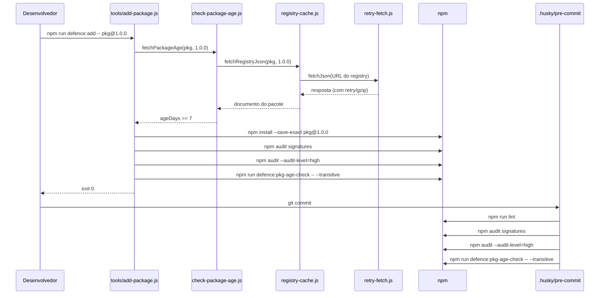

# Arquitetura

Este documento descreve a arquitetura de alto nível do projeto: como os arquivos, scripts e camadas de segurança se encaixam.

## Estrutura do Repositório

```bash
.
├── .husky/pre-commit        # Hook do Git executado a cada commit
├── .npmrc                   # Defaults endurecidos do npm
├── biome.json               # Configuração de lint e format do Biome
├── package.json             # Manifesto do projeto e scripts npm
├── package-lock.json        # Árvore de dependências determinística
├── README.md                # Documentação de entrada
├── docs/                    # Documentação multilíngue (en, pt-BR)
└── tools/                   # Scripts de defesa e testes
    ├── add-package.js
    ├── check-package-age.js
    ├── check-updates.js
    ├── install-defences.js
    ├── setup-bootstrap.js
    ├── update-packages.js
    └── lib/
        ├── package-utils.js
        ├── registry-cache.js
        ├── retry-fetch.js
        └── sync-check.js
```

## Componentes

| Componente | Responsabilidade |
| --- | --- |
| `package.json` | Declara dependências, scripts, engines e configurações do `pkgAgeCheck`. |
| `.npmrc` | Impõe `save-exact`, `ignore-scripts`, `min-release-age=7`, `audit-level=high`, etc. |
| `.husky/pre-commit` | Dispara `npm run lint`, audit de assinaturas e verificação transitiva de idade antes de cada commit. |
| `tools/check-package-age.js` | Consulta o registry do npm para aplicar a idade mínima dos pacotes. |
| `tools/check-updates.js` | Alerta sobre atualizações disponíveis e as classifica como elegíveis ou em quarentena. |
| `tools/add-package.js` | Wrapper controlado para `npm install` que executa verificações de idade, assinatura, audit e idade transitiva. |
| `tools/setup-bootstrap.js` | Realiza a primeira instalação quando `package-lock.json` está ausente. |
| `tools/update-packages.js` | Wrapper controlado para `npm update`. |
| `tools/install-defences.js` | Copia as defesas para outro projeto Node.js. |
| `tools/lib/package-utils.js` | Helpers compartilhados para parse de especificadores de pacotes. |
| `tools/lib/registry-cache.js` | Cache em disco de respostas do registry compartilhado entre as ferramentas. |
| `tools/lib/retry-fetch.js` | Camada compartilhada de fetch com suporte a gzip, limite de tamanho e retry/backoff. |
| `tools/lib/sync-check.js` | Verifica se `node_modules` está sincronizado com `package-lock.json`. |
| `biome.json` | Configura o Biome como linter e formatter. |

## Fluxo de Adição de Dependência



## Camada Compartilhada de Registry

As ferramentas que consultam o registry do npm (`check-package-age.js`, `check-updates.js`) não chamam `https.get` diretamente. Elas passam por dois módulos compartilhados:

- **`tools/lib/retry-fetch.js`** — gerencia HTTPS, descompressão gzip, limite de tamanho de resposta e retry com backoff exponencial. Faz retry apenas em erros de rede e nos códigos HTTP `429`, `502`, `503`, `504`; outras falhas (por exemplo, `404`, JSON inválido) falham rápido para evitar loops infinitos.
- **`tools/lib/registry-cache.js`** — armazena em disco, em `.cache/registry/`, respostas bem-sucedidas do registry indexadas por `name@version`. As entradas respeitam um TTL configurável, podem ser ignoradas com `force: true` e são totalmente desabilitadas quando a variável de ambiente `DEFENCE_NO_CACHE=1` está definida.

Esse design mantém o comportamento de rede consistente, reduz chamadas repetidas ao registry e faz com que todos os consumidores se beneficiem automaticamente de melhorias de performance e resiliência.

## Decisões de Design

- **Apenas módulos nativos do Node.js** nos scripts de tooling, para que possam rodar antes de qualquer dependência estar instalada.
- **Padrão de injeção** (`setSpawnSyncImpl` / `resetSpawnSyncImpl`, `setImpls` / `resetImpls`) torna os scripts testáveis sem executar comandos reais do `npm`.
- **Camada compartilhada de fetch/cache** centraliza retry, gzip e cache para que nenhuma ferramenta precise reimplementá-los.
- **Prefixo defence:*** agrupa todos os scripts relacionados à segurança e reduz o atrito ao adotar as defesas em outros projetos.
