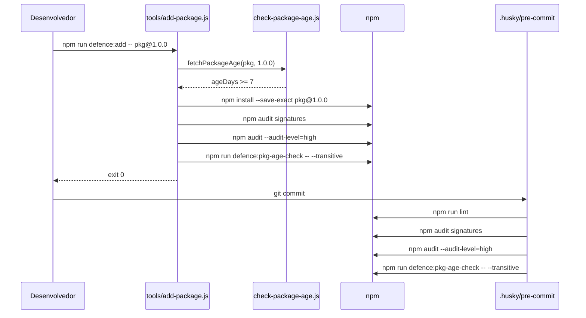

# Arquitetura

Este documento descreve a arquitetura de alto nível do projeto: como os arquivos, scripts e camadas de segurança se encaixam.

## Estrutura do Repositório

```bash
.
├── .husky/pre-commit        # Hook do Git executado a cada commit
├── .npmrc                   # Defaults endurecidos do npm
├── biome.json               # Configuração de lint e format do Biome
├── package.json             # Manifesto do projeto e scripts npm
├── package-lock.json        # Árvore de dependências determinística
├── README.md                # Documentação de entrada
├── docs/                    # Documentação multilíngue (en, pt-BR)
└── tools/                   # Scripts de defesa e testes
    ├── add-package.js
    ├── check-package-age.js
    ├── install-defences.js
    ├── setup-bootstrap.js
    ├── update-packages.js
    └── lib/package-utils.js
```

## Componentes

| Componente | Responsabilidade |
| --- | --- |
| `package.json` | Declara dependências, scripts, engines e configurações do `pkgAgeCheck`. |
| `.npmrc` | Impõe `save-exact`, `ignore-scripts`, `min-release-age=7`, `audit-level=high`, etc. |
| `.husky/pre-commit` | Dispara `npm run lint`, audit de assinaturas e verificação transitiva de idade antes de cada commit. |
| `tools/check-package-age.js` | Consulta o registry do npm para aplicar a idade mínima dos pacotes. |
| `tools/add-package.js` | Wrapper controlado para `npm install` que executa verificações de idade, assinatura, audit e idade transitiva. |
| `tools/setup-bootstrap.js` | Realiza a primeira instalação quando `package-lock.json` está ausente. |
| `tools/update-packages.js` | Wrapper controlado para `npm update`. |
| `tools/install-defences.js` | Copia as defesas para outro projeto Node.js. |
| `tools/lib/package-utils.js` | Helpers compartilhados para parse de especificadores de pacotes. |
| `biome.json` | Configura o Biome como linter e formatter. |

## Fluxo de Adição de Dependência



## Decisões de Design

- **Apenas módulos nativos do Node.js** nos scripts de tooling, para que possam rodar antes de qualquer dependência estar instalada.
- **Padrão de injeção** (`setSpawnSyncImpl` / `resetSpawnSyncImpl`) torna os scripts testáveis sem executar comandos reais do `npm`.
- **Prefixo defence:*** agrupa todos os scripts relacionados à segurança e reduz o atrito ao adotar as defesas em outros projetos.
