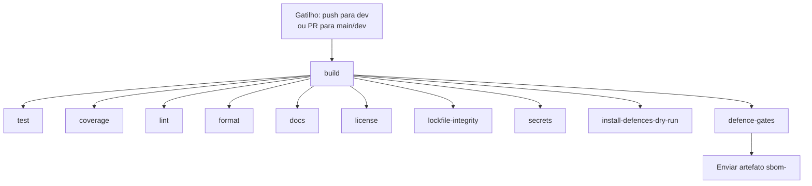

# Visão geral de CI/CD

O fluxo de integração contínua do repositório é definido em [`.github/workflows/ci.yml`](../../.github/workflows/ci.yml). Ele foi projetado para detectar problemas na cadeia de suprimentos o mais cedo possível, impor tokens GitHub com privilégios mínimos e garantir que todos os jobs sejam executados exatamente contra as mesmas dependências instaladas.

## Gatilhos do workflow

- `push` na branch `dev`
- `pull_request` para `main` e `dev`

Isso limita as execuções automáticas na branch protegida `main` apenas a pull requests.

## Diagrama do workflow



## Jobs

| Job | Objetivo | Etapa principal |
|---|---|---|
| `build` | Preparar um ambiente reprodutível | `npm ci` + envio do artefato `node_modules` |
| `test` | Executar a suíte de testes | Baixar artefato, `npm test` |
| `coverage` | Medir a cobertura de testes | Baixar artefato, comando de cobertura |
| `lint` | Verificar a qualidade do código | `npm run lint` |
| `format` | Verificar a formatação | `npm run format:check` |
| `docs` | Validar a documentação | Verificações de docs |
| `license` | Validar licenças das dependências | Auditoria de licenças |
| `lockfile-integrity` | Verificar consistência do lockfile | Verificações do lockfile |
| `secrets` | Escanear segredos vazados | Escaneamento de segredos |
| `install-defences-dry-run` | Verificar o manifesto local e simular a instalação | `npm run defence:verify-defences` + `node ./tools/install-defences.js /tmp/target-project --dry-run` |
| `defence-gates` | Executar as defesas e produzir um SBOM | Enviar `/tmp/sbom.json` como `sbom-${{ github.run_id }}` |

Cada job possui `timeout-minutes: 15` para evitar workers descontrolados.

## Ações fixadas por SHA

Todas as GitHub Actions são fixadas por commit SHA com um comentário de versão semântica, por exemplo:

```yaml
- uses: actions/checkout@3d3c42e5aac5ba805825da76410c181273ba90b1 # v7
```

Fixação por SHA garante que o código exato e auditado seja executado, mesmo que uma tag seja movida ou comprometida. O Dependabot está configurado em [`.github/dependabot.yml`](../../.github/dependabot.yml) para propor atualizações semanais com o prefixo `chore(deps)`.

## Cache de `node_modules` como artefato

O job `build` instala as dependências uma vez com `npm ci` e cria um tarball chamado `node_modules.tar.gz`. Esse tarball é então enviado como um artefato chamado:

```text
node_modules-${{ github.run_id }}
```

Os jobs dependentes baixam esse artefato e extraem o tarball em vez de executar `npm ci` novamente. Usamos um artefato em vez de `actions/cache` porque:

- **Determinismo:** cada job da execução recebe exatamente a mesma árvore `node_modules`.
- **Sem envenenamento entre execuções:** o artefato é limitado à execução atual do workflow e expira após `retention-days: 1`.
- **Auditabilidade:** o artefato pode ser baixado e inspecionado posteriormente.

A árvore é arquivada como `tar.gz` porque os artefatos do GitHub Actions são armazenados como arquivos ZIP, que não preservam symlinks Unix nem permissões executáveis. Um tarball preserva as entradas de `node_modules/.bin` exatamente como `npm ci` as produziu, evitando falhas como `sh: 1: biome: not found`.

## Permissões mínimas do `GITHUB_TOKEN`

O workflow usa permissões mínimas no nível do workflow:

```yaml
permissions:
  contents: read
  actions: write
```

- `contents: read` é suficiente para fazer checkout do código.
- `actions: write` é necessário para enviar e baixar artefatos.
- Nenhum outro escopo é concedido, limitando o raio de ação de uma action comprometida.

## Baixar e inspecionar o SBOM

O job `defence-gates` envia `/tmp/sbom.json` como:

```text
sbom-${{ github.run_id }}
```

com `retention-days: 30` e `archive: false`, então o arquivo JSON pode ser baixado diretamente do sumário da execução do workflow.

Pela linha de comando:

```bash
gh run download <run-id> -n sbom-<run-id>
```

Para mais detalhes, consulte [sbom-and-compliance.md](sbom-and-compliance.md).

## actionlint

O job `build` executa `actionlint` usando um binário fixado:

```text
actionlint v1.7.4
SHA256: fc0a6886bbb9a23a39eeec4b176193cadb54ddbe77cdbb19b637933919545395
```

O hook local [`.husky/pre-commit`](../../.husky/pre-commit) também executa `actionlint` quando instalado; a ausência do binário local emite apenas um aviso, mas o CI o impõe.

## Solução de problemas

### Falha ao baixar artefato

- Verifique se o job `build` foi concluído com sucesso.
- Confirme que o artefato não expirou (`retention-days: 1` para `node_modules`).
- Confirme que o job dependente depende de `build`.

### `node_modules is out of sync` ou `biome: not found` no CI

Esses erros geralmente significam que o artefato `node_modules` perdeu metadados Unix durante o ciclo de upload/download:

- **Causa:** `actions/upload-artifact` armazena artefatos como arquivos ZIP, que descartam symlinks e bits executáveis dentro de `node_modules/.bin`.
- **Correção neste workflow:** o job `build` cria `node_modules.tar.gz` com `tar`, e os jobs downstream o extraem com `tar --extract --gzip --file node_modules.tar.gz`.
- **Verificação local:** execute `npm run defence:sync-check` e confirme que `./node_modules/.bin/biome --help` funciona após um `npm ci` limpo.
- **Forçar atualização:** envie um novo commit ou reexecute o workflow; o artefato é regenerado a cada execução.

### Timeout de job

- Todos os jobs têm limite de 15 minutos. Se um job atingir o timeout, verifique testes travados ou retries de rede.

### Falha do actionlint

- Certifique-se de que o YAML do workflow é válido.
- Execute `actionlint` localmente se estiver instalado.
- No CI, apenas o binário fixado é usado.

### Divergência do manifesto

- Execute `npm run defence:verify-defences` localmente.
- Garanta que o manifesto corresponda ao estado commitado.
